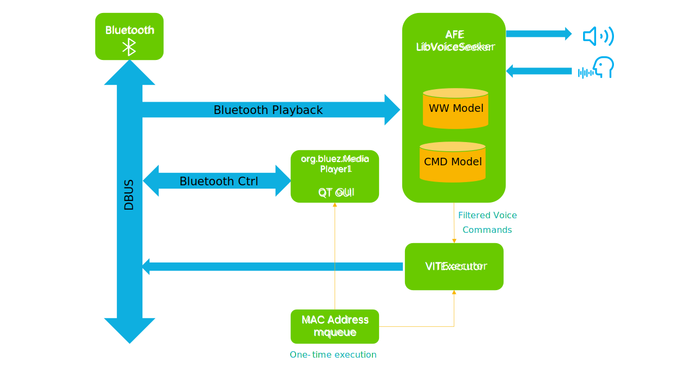
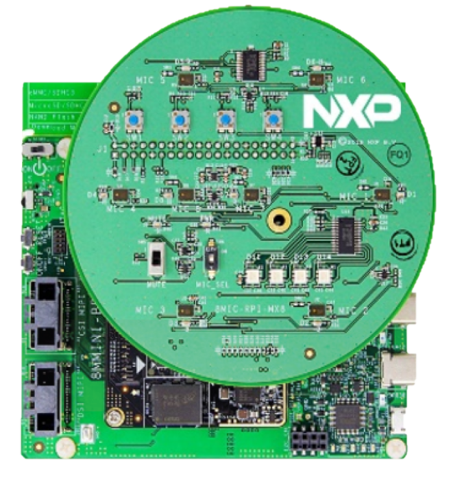
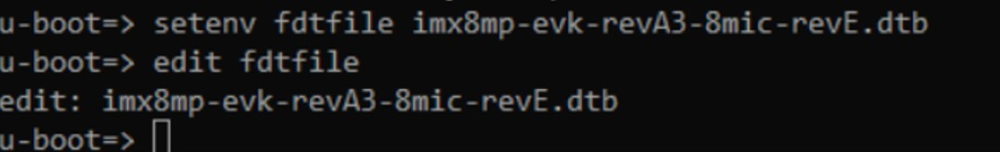
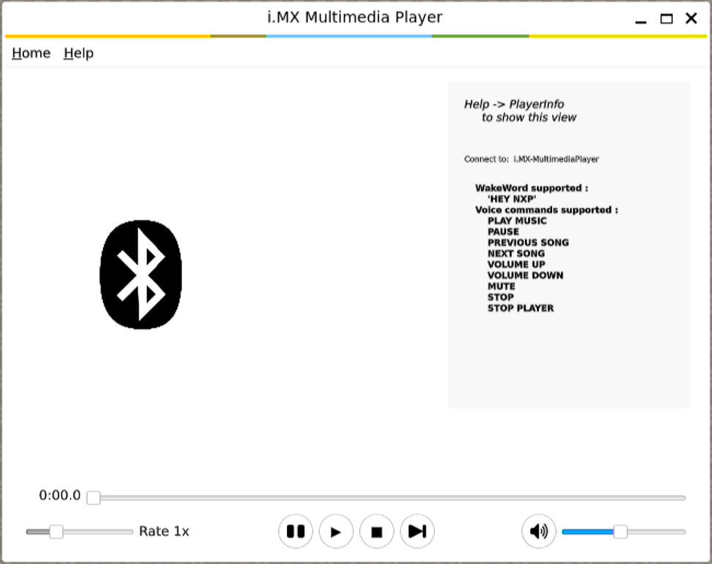
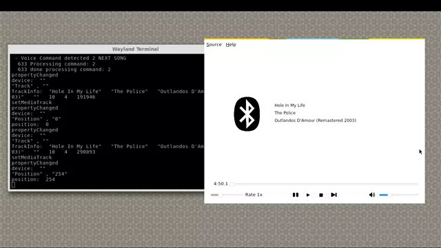

# i.MX Voice Player

<!----- Boards ----->
[](./BSD_3_Clause.txt)
[](https://www.nxp.com/products/processors-and-microcontrollers/arm-processors/i-mx-applications-processors/i-mx-8-applications-processors/i-mx-8m-mini-arm-cortex-a53-cortex-m4-audio-voice-video:i.MX8MMINI)
[](https://www.nxp.com/products/processors-and-microcontrollers/arm-processors/i-mx-applications-processors/i-mx-8-applications-processors/i-mx-8m-plus-arm-cortex-a53-machine-learning-vision-multimedia-and-industrial-iot:IMX8MPLUS)
[](https://www.nxp.com/products/processors-and-microcontrollers/arm-processors/i-mx-applications-processors/i-mx-9-processors/i-mx-93-applications-processor-family-arm-cortex-a55-ml-acceleration-power-efficient-mpu:i.MX93)


[*i.MX Voice Player*](https://github.com/nxp-imx-support/imx-voiceplayer.git) demo application  is a  Bluetooth Media Player controlled by Voice, it is based on NXP's Voice Intelligent Technology (VIT), a free library that provides a low power voice recognition technology, integrating a complete audio front-end / wake word engine / voice commands solution to control IoT devices. For more information, please refer to
[GoPoint for i.MX Applications Processors User's Guide](https://www.nxp.com/docs/en/user-guide/GPNTUG.pdf?_gl=1*gz87wm*_ga*ODQxOTk0OTQwLjE3MDQ5ODk3NzA.*_ga_WM5LE0KMSH*MTcwNDk4OTc2OS4xLjEuMTcwNDk4OTgyOS4wLjAuMA..).

## Implementation using VIT and Bluetooth

>**NOTE:** This block diagram is simplified and do not represent the complete elements. Some elements
were omitted and only the key elements are shown.

*MAC Address mqueue* starts operating in one-time execution, followed by two instances that run in parallel, which are *QT GUI* instance, which serves as the grafical interface, and *VITExecutor*. After those process are completed, *AFE* instance utilizes voice input from microphones to detect WakeWords and Commands which are registered in the *DBUS* (Desktop Bus). Finally, the EVK remains in standby mode, awaiting pairing with a Bluetooth device, or, if the demo is already in progress, the *AFE* instance continues to listen for voice Commands and WakeWords. Below is a simplified block diagram.



The application relies on  the BlueZ 5.65 API for playing back audio and controlling the Bluetooth adapter.


## Table of Contents
1. [Software](#1-software)
2. [Hardware](#2-hardware)
3. [Build Instructions](#2-hardware)
4. [Setup](#3-setup)
5. [Results](#4-results)
6. [FAQs](#5-faqs) 
7. [Support](#6-support)
8. [Release Notes](#7-release-notes)

## 1 Software

*i.MX Voice Player* is part of Linux BSP available at [Embedded Linux for i.MX Applications Processors](https://www.nxp.com/design/design-center/software/embedded-software/i-mx-software/embedded-linux-for-i-mx-applications-processors:IMXLINUX). All the required software and dependencies to run this
application are already included in the BSP.

i.MX Board          | Main Software Components
---                 | ---
**i.MX8M Mini EVK** | QT6.2, Bluez 5.65 API,<br>Pulse Auido, WM8960 Encodec     
**i.MX8M Plus EVK** | QT6.2, Bluez 5.65 API,<br>Pulse Audio, WM8960 Encodec
**i.MX93 EVK**      | QT6.2, Bluez 5.65 API,<br>Pulse Audio, WM8962 Encodec

## 2 Hardware

To test *i.MX Voice Player*, on either of the  EVKs  supported it is necessary to  have the  correct setup.

Component                                         | i.MX8M Mini        | i.MX8M Plus        | i.MX93
---                                               | :---:              | :---: | :---:
Power Supply                                      | :white_check_mark: | :white_check_mark: | :white_check_mark:
HDMI Display                                      | :white_check_mark: | :white_check_mark: | :white_check_mark:
USB micro-B cable (Type-A male to Micro-B male)   | :white_check_mark: | :white_check_mark: |
USB Type-C cable  (Type-A male to Type-C male)    |         |           | :white_check_mark:
HDMI cable                                        | :white_check_mark:  | :white_check_mark: | :white_check_mark:
IMX-MIPI-HDMI (MIPI-DSI to HDMI adapter)          |   :white_check_mark: | :white_check_mark: | :white_check_mark:
Mini-SAS cable                                    |                    :white_check_mark: | :white_check_mark: | :white_check_mark:
8MIC RPI MX8                           | :white_check_mark: | :white_check_mark: | 


## 3 Build Instrucctions

The *i.MX Voice Player* demo is build by NXP SDK which includes cross-develoment toolchain, cross-compiler and libraries. A build script is included 
to automate the build process.

### Step 1

Setup your i.MX8 SDK environment:

```bash
source /opt/fsl-imx-xwayland/6.1-langdale/environment-setup-armv8a-poky-linux
```

**Note:** The build script make use of some variables which need to be set before compiling (VOICE_UI, ASSETS, VOICE_UI_BRANCH, ASSETS_BRANCH):

* VOICE_UI: Repository of voice_ui.
* ASSETS: Repository of assets.
* VOICE_UI_BRANCH: Branch name for voice_ui repository.
* ASSETS_BRANCH: Branch name for assets repository.

```bash
export VOICE_UI=https://github.com/nxp-imx/imx-voiceui.git
export ASSETS=https://github.com/nxp-imx-support/nxp-demo-experience-assets.git
export VOICE_UI_BRANCH=MM_04.09.00_2405_L6.6.y
export ASSETS_BRANCH=lf-6.6.23_2.0.0
```

Note: ASSETS_BRANCH can be updated from lf-6.6.23_2.0.0 version onward, and VOICE_UI_BRANCH from MM_04.09.00_2405_L6.6.y version onward.

These are the variables format to use:
```bash
export VOICE_UI_BRANCH=<MM_04.xx.yy_zzzz_L6.1.y>
export ASSETS_BRANCH=<lf-6.6.y_x.y.z>
```

### Step 2 - run build script

This script will download app components, build and package the binary application into *build_output_demo.tgz* file

```bash
sh build-demo.sh
```

### Step 3 - install

Copy *build_output_demo.tgz* directory to iMX8 evk, extract its contents and run *install.sh* script in target:

```bash
tar xvf build_output_demo.tgz
cd build_output_demo
sh install.sh
```

## 4 Setup

On the iMX8M Plus and iMX8M Mini, the Multimedia Player demo requires the 8MIC-RPI-MX8 installed on the i.MX hardware for voice enablement, 8MIC-RPI-MX8 hardware require to set the FDTFILE to a proper 8-microphone board revision DTB in the U-Boot environment, for details, please refer to
[8MIC-RPI-MX8.](https://www.nxp.com/part/8MIC-RPI-MX8#/).

 


To run the demo, execute the init.sh script on the console, It takes a few seconds to load the application and dependencies. Once the i.MX multimedia player is launched, use a smartphone or a tablet to search for the **i.MX-MultimediaPlayer** Bluetooth device and pair it.

```bash
sh /opt/gopoint-apps/scripts/multimedia/imx-voiceplayer/init.sh
```



Once a Bluetooth device is connected, the user can start controlling audio playback using voice commands.
Use the WakeWord *"Hey NXP"* to let VIT wake up the device and then use a voice command to control the playback, if the audio playback contains metadata this will be displayed in the application UI, the supported voice commands to control the audio are:
- Play Music 
- Pause 
- Next Song
- Previous Song
- Mute 
- Volume Up
- Volume Down
- Stop 
- Stop Player 


## 5 Results

When *i.MX Voice Player* is active, the following features are available on the display and can be accessed through the auxiliary of the EVK:

1. The Wayland Terminal, which identifies the paired device, along with supported WakeWords and Commands.
2. The displayed window containing information and assitance for the demo, including Bluetooth's logo and featuring buttons to control playback functions such as pause, play, stop or skip to the next song.
3. The currently playing song is showcased on the main window.
4. The selected song can be controlled and switched, additionally, volume levels can be adjusted using the supported commands.



## 6 FAQs

### Is the source code of i.MX Voice Player available

Yes, the source code is available under the [BSD-3-Clause License](https://opensource.org/license/BSD-3-clause) at
https://github.com/nxp-imx-support/imx-voiceplayer.git. There it is more information on how to customize the demo. 

### No Bluetooth Connection
The i.MX8MP uses an AzureWave CM276MA (NXP 88W8997) Wireless module for Bluetooth 5.1, make sure the WIFI module is correctly installed in the EVK.

### No Audio Metadata is displayed
The audio playback might not contain the music metadata, if metadata is contained in the audio it will be show on the GUI, if not a message  *"Not Provided"*  will be displayed. 

### No voice detected
The i.MX8MM and i.MX8MP requires to install 8MIC-RPI-X8M hardware revision and set the proper Device tree to enable voice input.  For details, refer [8MIC-RPI-MX8](https://www.nxp.com/part/8MIC-RPI-MX8#/).

### No audio output
If you experience no audio output make sure your volume settings are not muted or set too low, ensure your speakers or headphones are properly connected to the audio output jack on your EVK.


## 7 Support

Questions regarding the content/correctness of this example can be entered as Issues within this GitHub repository.

>**Warning**: For more general technical questions, enter your questions on the [NXP Community Forum](https://community.nxp.com/)

[](https://www.youtube.com/NXP_Semiconductors)
[](https://www.linkedin.com/company/nxp-semiconductors)
[](https://www.facebook.com/nxpsemi/)
[](https://twitter.com/NXP)

## 8. Release Notes

Version | Description                         | Date
---     | ---                                 | ---
1.0.0   | Initial release                     | June 28<sup>th</sup> 2024
 

## Licensing

*i.MX Voice Player* is licensed under the [BSD-3-Clause License](https://opensource.org/license/BSD-3-clause).
