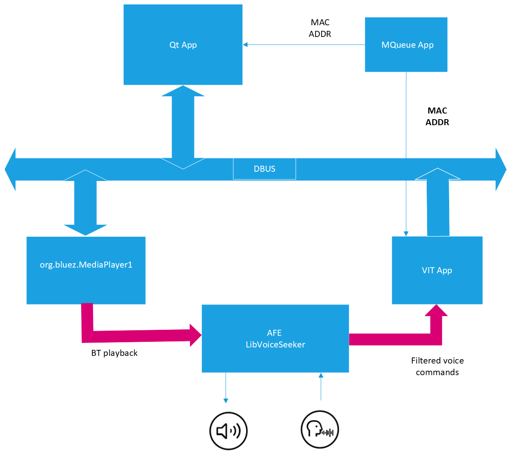

# i.MX Voice Player

[](./LICENSE)

The i.MX Voice Player demo application for i.MX8MP, i.MX8MM and i.MX93 is a voice media player based in NXP's Voice
Intelligent Technology (VIT), a free library that provides a low power voice recognition technology, integrating a
complete audio front-end / wake word engine / voice commands solution to control IoT devices.



The application is based on QT Interface 6.2 and Bluez 5.65 API for playing back audio and control the Bluetooth
adapter.

## Build Instructions

### Step 1

Setup your i.MX8 SDK environment:

```bash
source /opt/fsl-imx-internal-xwayland/6.1-langdale/environment-setup-armv8a-poky-linux
```

**Note:** It needs to set some variables before compiling (VOICE_UI, ASSETS, VOICE_UI_BRANCH, ASSETS_BRANCH):

* VOICE_UI: Repository of voice_ui.
* ASSETS: Repository of assets.
* VOICE_UI_BRANCH: Branch name for voice_ui repository.
* ASSETS_BRANCH: Branch name for assets repository.

```bash
export VOICE_UI=https://github.com/nxp-imx/imx-voiceui.git
export ASSETS=https://github.com/nxp-imx-support/nxp-demo-experience-assets.git
export VOICE_UI_BRANCH=MM_04.08.00_2305_L6.1.y
export ASSETS_BRANCH=lf-6.1.36_2.1.0
```

Note: ASSETS_BRANCH can be updated from lf-6.1.36_2.1.0 version onward, and VOICE_UI_BRANCH from MM_04.08.00_2305_L6.1.y version onward.

These are the variables format to use:
```bash
export VOICE_UI_BRANCH=<MM_04.xx.yy_zzzz_L6.1.y>
export ASSETS_BRANCH=<lf-6.6.y_x.y.z>
```

### Step 2 - run build script

This script will download app components, build and package the binary application into *build_output_demo.tgz* file

```bash
sh build-demo.sh
```

### Step 3 - install

Copy *build_output_demo.tgz* directory to iMX8 evk, extract its contents and run *install.sh* script in target:

```bash
tar xvf build_output_demo.tgz
cd build_output_demo
sh install.sh
```

## Test i.MX Voice Player

### Run from binary

Login using root password and go to the installed directory and execute the init script to launch the player application:

```bash
sh /home/root/.nxp-demo-experience/scripts/multimedia/imx-voiceplayer/init.sh
```

### Run from Demo Experience

i.MX Voice Player is also available at NXP Demo Experience under bluetooth icon.

Demo has been tested on:

| BOARD               | MACHINE           |
| ------------------- | ----------------- |
| i.MX 8M Plus (DDR4) | imx8mp-lpddr4-evk |
| i.MX 8M Mini (DDR4) | imx8mm-lpddr4-evk |
| i.MX 93             | imx93evk          |
